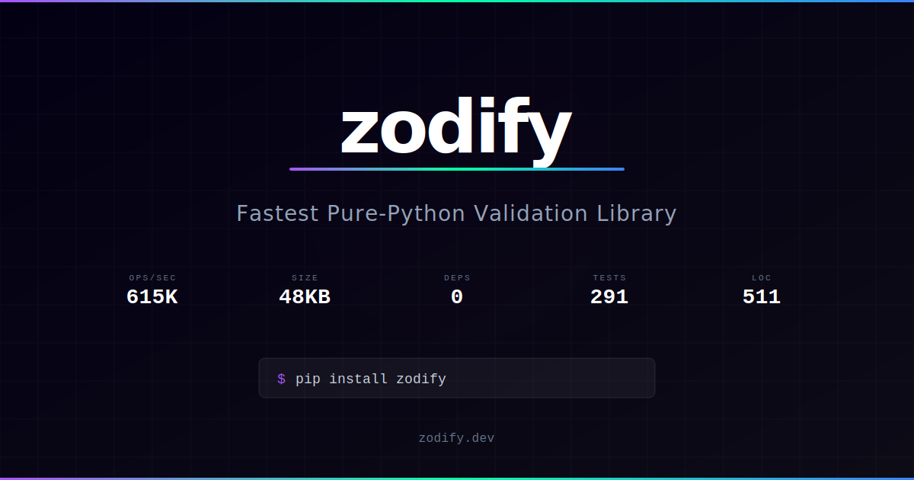

<h1 align="center">zodify</h1>

<p align="center">
  <strong>Zod-inspired dict validation for Python. Zero deps. One file.</strong>
</p>

<p align="center">
  <a href="https://pypi.org/project/zodify/"></a>
  <a href="https://pypi.org/project/zodify/"></a>
  <a href="https://github.com/junyoung2015/zodify/blob/main/LICENSE"></a>
</p>

<p align="center">
  <a href="https://zodify.dev">Website</a> · <a href="https://zodify.dev/docs">Docs</a> · <a href="https://zodify.dev/benchmarks">Benchmarks</a> · <a href="https://github.com/junyoung2015/zodify/issues">Issues</a> · <a href="https://github.com/junyoung2015/zodify/blob/main/CHANGELOG.md">Changelog</a>
</p>

---

<p align="center">
  <a href="https://zodify.dev">
    
  </a>
</p>

**Note:** zodify is in alpha. The API is minimal and may change. Feedback and contributions are welcome!

---

## Quick Start

```python
from zodify import validate

config = validate(
    {"port": int, "debug": bool},
    {"port": 8080, "debug": True},
)
```

That's it. Plain dicts in, validated dicts out. No classes, no DSL, no dependencies.

---

## Why zodify?

Most validation libraries ask you to learn a new DSL or model system. zodify doesn't.

|                    | zodify           | zon                          | zodic                        | Pydantic               |
| ------------------ | ---------------- | ---------------------------- | ---------------------------- | ---------------------- |
| Philosophy         | Minimalist       | Full Zod port                | Full Zod port                | Full ORM               |
| API style          | Plain dicts      | Chained builders             | Chained builders             | Classes                |
| Schema composition | Plain dict reuse | Requires schema DSL/builders | Requires schema DSL/builders | Requires model classes |
| Dependencies       | **0**            | 2                            | 0                            | 4                      |
| Code size          | **511 LOC**      | ~1,900 LOC                   | ~1,400 LOC                   | ~32,000 LOC            |
| Learning curve     | **Zero**         | Must learn DSL               | Must learn DSL               | Must learn DSL         |
| Env var support    | **Built-in**     | No                           | No                           | Partial                |

---

## Install

```bash
pip install zodify
```

> Requires Python 3.10+
>
> To install from source:
>
> ```bash
> git clone https://github.com/junyoung2015/zodify.git && pip install ./zodify
> ```

---

## Usage

### `validate()` - Dict Schema Validation

Define a schema as a plain dict of `key: type` pairs, then validate any dict against it.

```python
from zodify import validate

schema = {"port": int, "debug": bool, "name": str}

# Exact type match
result = validate(schema, {"port": 8080, "debug": True, "name": "myapp"})
# → {"port": 8080, "debug": True, "name": "myapp"}

# Coerce strings - great for env vars and config files
raw = {"port": "8080", "debug": "true", "name": "myapp"}
result = validate(schema, raw, coerce=True)
# → {"port": 8080, "debug": True, "name": "myapp"}

# All errors are collected at once
validate({"a": int, "b": str}, {"a": "x", "b": 42})
# ValueError: a: expected int, got str
#             b: expected str, got int
```

**Parameters:**

| Param          | Type   | Default    | Description                                           |
| -------------- | ------ | ---------- | ----------------------------------------------------- |
| `schema`       | `dict` | -          | Mapping of keys to expected types (`str`, `int`, ...) |
| `data`         | `dict` | -          | The dict to validate                                  |
| `coerce`       | `bool` | `False`    | Cast string values to the target type when possible   |
| `max_depth`    | `int`  | `32`       | Maximum nesting depth to prevent stack overflow       |
| `unknown_keys` | `str`  | `"reject"` | How to handle extra keys: `"reject"` or `"strip"`     |
| `error_mode`   | `str`  | `"text"`   | Error output format: `"text"` or `"structured"`       |

**Behavior:**

- Extra keys in `data` are rejected by default (`unknown_keys="reject"`).
- Use `unknown_keys="strip"` to silently drop extra keys and return only schema-declared keys.
- Missing keys raise `ValueError`.
- When `coerce=True`, only `str` inputs are coerced to `int`, `float`, or `bool` (non-string mismatches still error). For `str` targets, any value is accepted via Python's `str()` builtin.
- Bool coercion accepts: `true/false`, `1/0`, `yes/no` (case-insensitive).

```python
# Default: reject unknown keys
validate({"name": str}, {"name": "kai", "age": 25})
# ValueError: age: unknown key

# Opt-in: strip unknown keys
validate(
    {"name": str},
    {"name": "kai", "age": 25},
    unknown_keys="strip",
)
# -> {"name": "kai"}
```

---

### Configuration

`validate()` remains the recommended starting point. Use `Validator` when you repeatedly apply the same options and want reusable defaults.

```python
from zodify import Validator

validator = Validator(
    coerce=True,
    max_depth=16,
    unknown_keys="strip",
    error_mode="structured",
)

result = validator.validate(
    {"port": int, "debug": bool},
    {"port": "8080", "debug": "true", "unused": "x"},
)
# -> {"port": 8080, "debug": True}
```

Per-call keyword arguments override instance defaults for that call only:

```python
from zodify import Validator

validator = Validator(coerce=False, unknown_keys="reject")

# Temporary override for one call:
result = validator.validate(
    {"port": int},
    {"port": "8080"},
    coerce=True,
)
# -> {"port": 8080}

# Defaults remain unchanged:
validator.validate({"port": int}, {"port": "8080"})
# ValueError: port: expected int, got str
```

---

### Structured Errors

By default, validation failures raise `ValueError` with human-readable messages. Use `error_mode="structured"` to get machine-readable `ValidationError` exceptions with an `.issues` list - ideal for API error responses.

```python
from zodify import validate, ValidationError

try:
    validate(
        {"port": int, "host": str},
        {"port": "abc", "host": 42},
        error_mode="structured",
    )
except ValidationError as e:
    print(e.issues)
    # [
    #   {"path": "port", "message": "expected int, got str", "expected": "int", "got": "str"},
    #   {"path": "host", "message": "expected str, got int", "expected": "str", "got": "int"},
    # ]
```

`ValidationError` subclasses `ValueError`, so existing `except ValueError` handlers still work. Each issue dict has four keys: `path`, `message`, `expected`, and `got`.

```python
# Works with all error types: type mismatch, missing key, coercion failure,
# custom validator failure, depth exceeded, unknown key, and union mismatch.

# Combine with other parameters freely:
validate(schema, data, coerce=True, unknown_keys="strip", error_mode="structured")
```

---

### Union Types

Use Python's `str | int` syntax to accept multiple types for a single key.

```python
schema = {"value": str | int}

validate(schema, {"value": "hello"})  # → {"value": "hello"}
validate(schema, {"value": 42})       # → {"value": 42}

validate(schema, {"value": 3.14})
# ValueError: value: expected str | int, got float
```

Types are checked left-to-right. With `coerce=True`, type order controls coercion priority:

```python
# str first → "42" stays as string (str coercion matches first)
validate({"value": str | int}, {"value": "42"}, coerce=True)
# → {"value": "42"}

# int first → "42" coerced to int (int coercion matches first)
validate({"value": int | str}, {"value": "42"}, coerce=True)
# → {"value": 42}
```

Union types compose with lists, nested dicts, and `Optional`:

```python
validate({"items": [int | str]}, {"items": ["42"]}, coerce=True)
# → {"items": [42]}

validate({"config": {"v": int | str}}, {"config": {"v": "42"}}, coerce=True)
# → {"config": {"v": 42}}
```

> **Note:** When `str` is a union member and `coerce=True`, `str` acts as a catch-all fallback - any value that fails earlier union members will coerce via `str()` (e.g., `int | str` with `True` produces `"True"`). Place `str` last in unions to use it as a deliberate fallback, or first to prefer string preservation.

> Requires Python 3.10+ (for `X | Y` union syntax).

---

### Nested Dict Validation

Your schema can contain nested dicts - validation recurses automatically.

```python
schema = {"db": {"host": str, "port": int}}

validate(schema, {"db": {"host": "localhost", "port": 5432}})
# → {"db": {"host": "localhost", "port": 5432}}

validate(schema, {"db": {"host": "localhost", "port": "bad"}})
# ValueError: db.port: expected int, got str
```

Errors use dot-notation paths: `db.host`, `a.b.c`, etc.

---

### Schema Composition

schemas are data, not DSL - they compose like dicts because they are dicts

```python
from zodify import validate

db_schema = {"host": str, "port": int}
credentials_schema = {"username": str, "password": str}
flag_schema = {"beta": bool | str}

service_schema = {
    "name": str,
    "db": db_schema,
    "credentials": credentials_schema,
    "flags": {
        "signup_flow": flag_schema,
    },
}

validate(
    service_schema,
    {
        "name": "api",
        "db": {"host": "localhost", "port": 5432},
        "credentials": {"username": "svc", "password": "secret"},
        "flags": {"signup_flow": {"beta": "true"}},
    },
    coerce=True,
)
```

For the full runnable version, see [`examples/nested_schemas.py`](examples/nested_schemas.py).

---

### Optional Keys

Use `Optional` to mark keys that can be missing. Provide a default, or omit it to exclude the key from results.

```python
from zodify import validate, Optional

schema = {
    "host": str,
    "port": Optional(int, 8080),     # default 8080
    "debug": Optional(bool),          # absent if missing
}

validate(schema, {"host": "localhost"})
# → {"host": "localhost", "port": 8080}
```

> **Note:** `Optional` shadows `typing.Optional`. If you use both in the same file, alias it: `from zodify import Optional as Opt` or use `zodify.Optional(...)`.

---

### List Element Validation

Use a single-element list as the schema value to validate every element in the list.

```python
validate({"tags": [str]}, {"tags": ["python", "config"]})
# → {"tags": ["python", "config"]}

validate({"tags": [str]}, {"tags": ["ok", 42]})
# ValueError: tags[1]: expected str, got int
```

List of dicts works too:

```python
validate(
    {"users": [{"name": str, "age": int}]},
    {"users": [{"name": "Alice", "age": 30}]},
)
```

---

### Combined Example

All features compose naturally:

```python
from zodify import validate, Optional

schema = {
    "db": {"host": str, "port": Optional(int, 5432)},
    "tags": [str],
    "debug": Optional(bool, False),
}

validate(schema, {
    "db": {"host": "localhost"},
    "tags": ["prod"],
})
# → {"db": {"host": "localhost", "port": 5432},
#    "tags": ["prod"], "debug": False}
```

---

### `env()` - Typed Environment Variables

Read and type-cast environment variables with a single call.

```python
from zodify import env

port   = env("PORT", int, default=3000)
debug  = env("DEBUG", bool, default=False)
secret = env("SECRET_KEY", str)  # raises ValueError if missing
```

**Parameters:**

| Param     | Type   | Default  | Description                                                                                       |
| --------- | ------ | -------- | ------------------------------------------------------------------------------------------------- |
| `name`    | `str`  | -        | Environment variable name                                                                         |
| `cast`    | `type` | -        | Target type (`str`, `int`, `float`, `bool`)                                                       |
| `default` | any    | _(none)_ | Fallback if the var is unset. **Not type-checked** - ensure your default matches the `cast` type. |

---

## Release Process

Release automation is tag-driven:

- Pushing a tag that matches `v*` triggers `.github/workflows/publish.yml`.
- The workflow runs tests, builds distributions, publishes to PyPI, and creates a GitHub Release.
- GitHub Release notes are sourced from the matching section in `CHANGELOG.md` (for example, `## [v0.1.0]`).

Run local preflight before tagging:

```bash
./scripts/release_preflight.sh
```

If preflight passes, push the release tag for the version in `pyproject.toml`:

```bash
git tag v0.5.0
git push origin v0.5.0
```

---

## Roadmap

zodify is in **alpha**. The API surface is small and may evolve. All pre-1.0 APIs are provisional per semver. See [`CHANGELOG.md`](CHANGELOG.md) for released version-by-version details.

**Shipped (current mainline capabilities):**

- [x] Nested schema validation with dot-path errors
- [x] Optional keys with defaults
- [x] List element validation (including list-of-dicts)
- [x] Custom validator functions
- [x] `unknown_keys` parameter (`"reject"` / `"strip"`)
- [x] `max_depth` recursion depth limit
- [x] Performance benchmark infrastructure
- [x] PEP 561 `py.typed` marker & inline type annotations
- [x] `@overload` signatures for `env()` (IDE type inference)
- [x] Google-style docstrings on all public API symbols
- [x] mypy (strict) & pyright CI gates
- [x] Union type schemas (`str | int` syntax) with left-to-right coercion priority
- [x] `ValidationError` exception with `.issues` for machine-readable errors
- [x] `error_mode="structured"` parameter on `validate()`
- [x] `Validator` class with reusable configuration defaults and per-call overrides
- [x] Runnable example scripts in `examples/` (`basic_validation.py`, `nested_schemas.py`, `custom_validators.py`, `union_types.py`, `env_config.py`, `structured_errors.py`)
- [x] README schema composition documentation with plain dict reuse patterns

**Planned:**

| Version | Theme                                           |
| ------- | ----------------------------------------------- |
| v0.6.0  | Class-based schema syntax (`Schema` base class) |
| v0.7.0  | `.env` file loading (`load_env()`)              |
| v0.8.0  | JSON Schema export (`to_json_schema()`)         |
| v1.0.0  | API freeze, documentation site at zodify.dev    |

**Post-v1.0 (exploring):**

- [ ] Framework integrations as extension packages (`zodify-fastapi`, etc.)

---

## License

[MIT](LICENSE) - 2026 Jun Young Sohn
